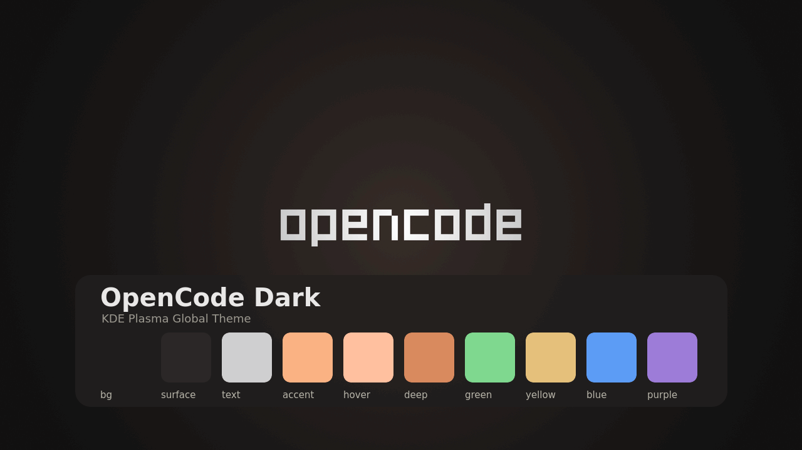
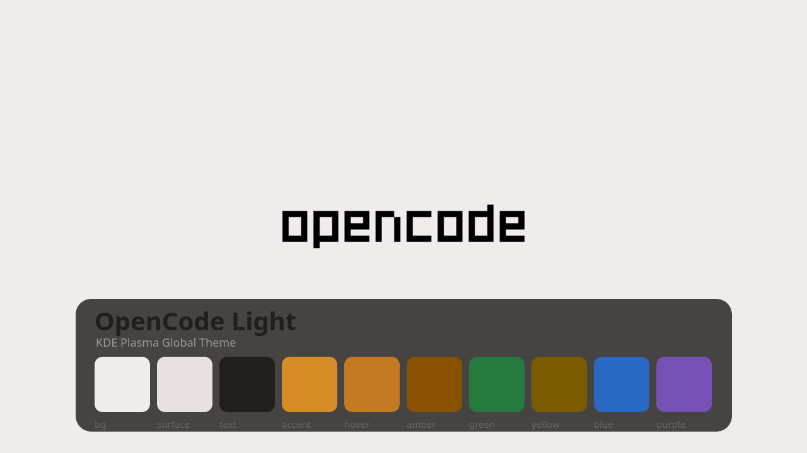
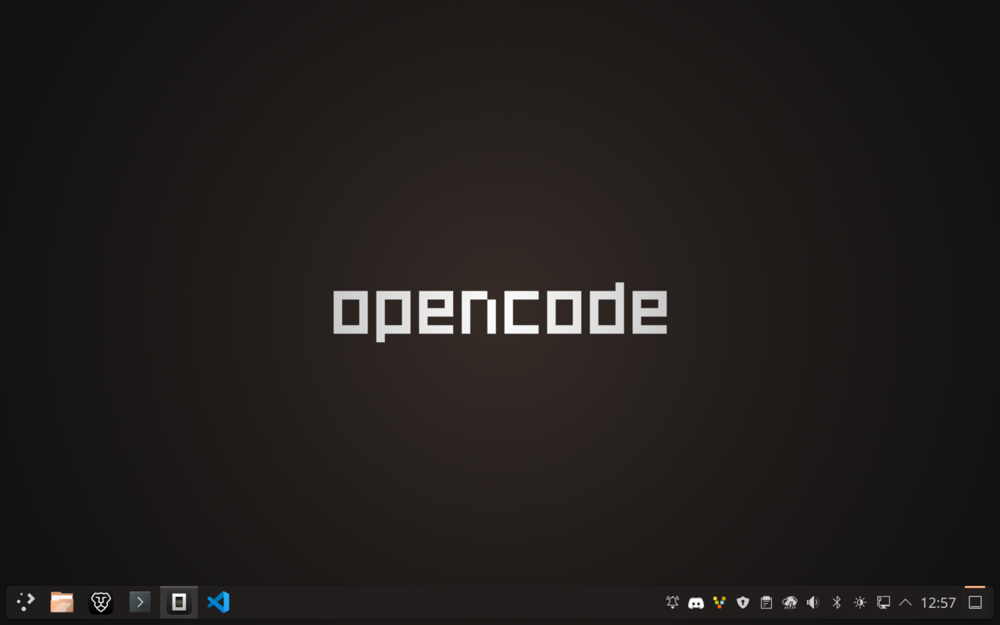
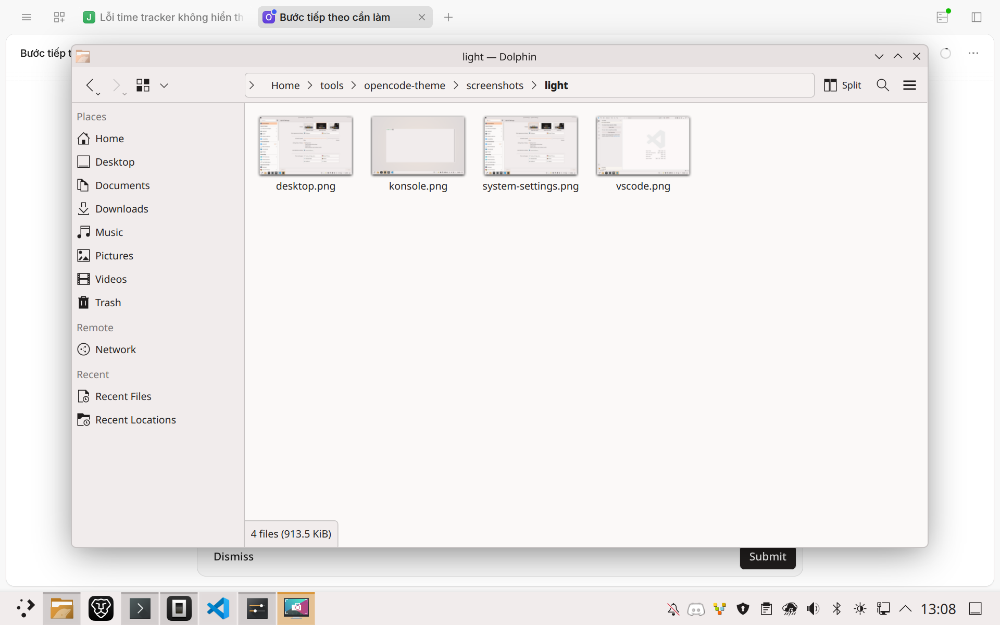
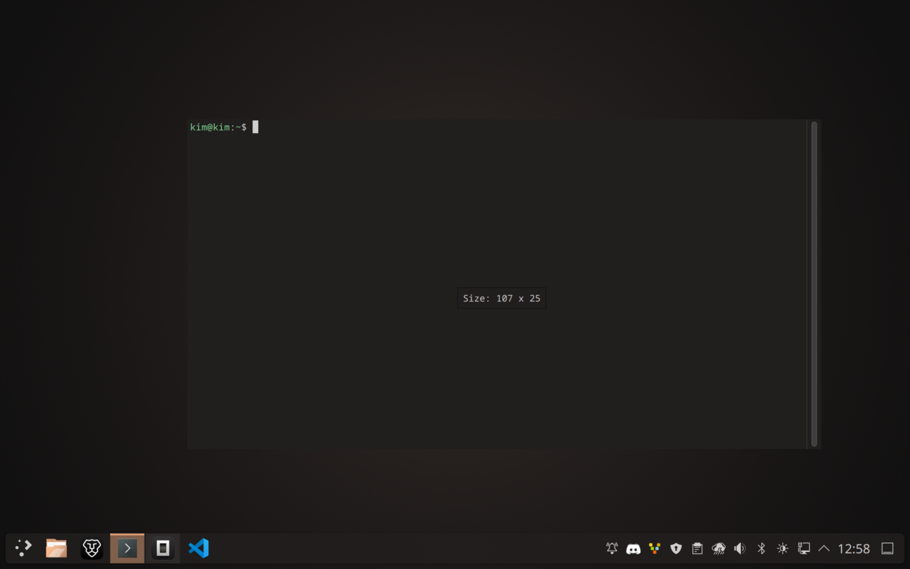
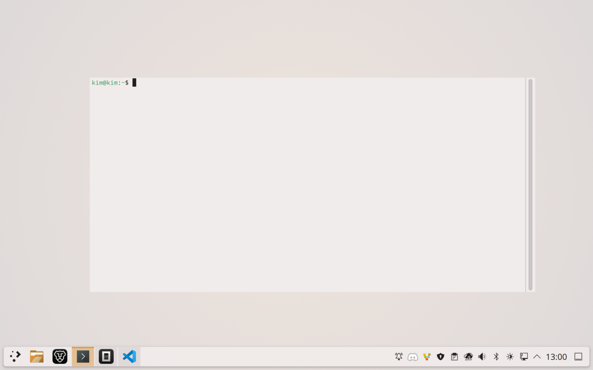
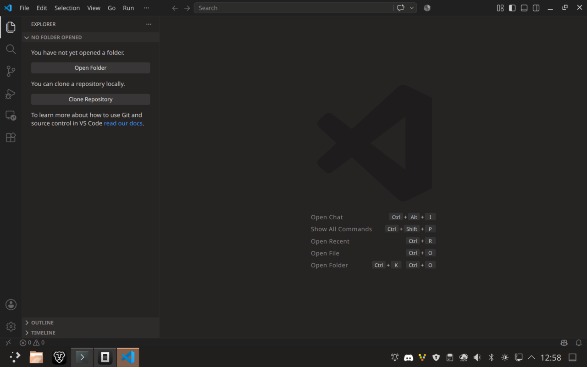
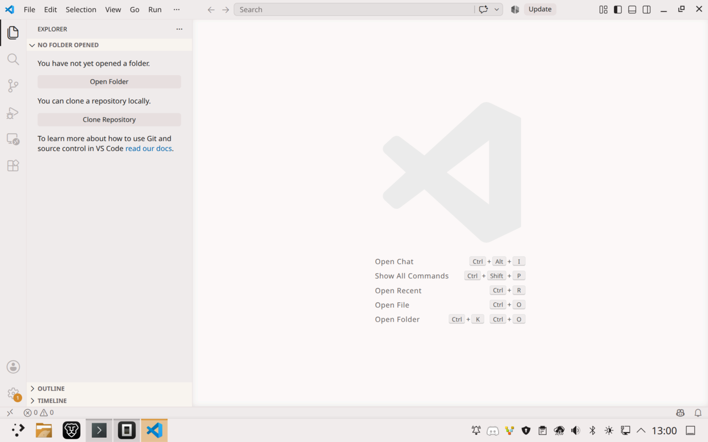

# OpenCode — KDE Plasma Themes (Dark + Light)

KDE Plasma 6 **Global Themes** inspired by the opencode.ai brand: warm neutral
surfaces taken from the site's logo palette (`#211E1E` / `#CFCECD` / `#656363`
dark, `#F1ECEC` / `#4B4646` / `#B7B1B1` light), with accents and terminal
colors from the official OpenCode app theme — the **peach** `#FAB283` on dark,
the **amber** `#D68C27` on light.

Includes matching color schemes for **Konsole** and **Alacritty**, and a pair of
modern wallpapers (dark + light) with the official **OpenCode simple wordmark**
(white on dark, black on light).

The wallpaper package ships **both variants** (`contents/images/` for light,
`contents/images_dark/` for dark), so Plasma automatically switches the
wallpaper when you switch between OpenCode Dark and OpenCode Light.

> ⚠️ **Unofficial community theme.** Not affiliated with, endorsed by, or
> produced by Anomaly / OpenCode. "OpenCode" is a trademark of its owners —
> this is a fan-made desktop theme that borrows the color palette.

<p align="center">
  
  
</p>

## Palette

### OpenCode Dark

| Role            | Hex        |
|-----------------|------------|
| Background      | `#211E1E`  |
| Panel / alt bg  | `#2A2626`  |
| Elevated        | `#363232`  |
| View / editor   | `#1C1B1B`  |
| Text            | `#CFCECD`  |
| Bright text     | `#E9E8E7`  |
| Muted text      | `#8A8585`  |
| **Accent (peach)** | `#FAB283` |
| Peach hover     | `#FFC09F`  |
| Peach deep      | `#D98A5E`  |
| Purple          | `#7651B5`  |

### OpenCode Light

| Role            | Hex        |
|-----------------|------------|
| Background      | `#F1ECEC`  |
| Panel / alt bg  | `#F9F6F6`  |
| Elevated        | `#FAF7F6`  |
| View / editor   | `#FBF9F8`  |
| Text            | `#211E1E`  |
| Secondary text  | `#4B4646`  |
| Muted text      | `#6B6666`  |
| **Accent (amber)** | `#D68C27` |
| Amber hover     | `#C47A22`  |
| Amber deep      | `#B06F1E`  |
| Purple          | `#9D7CD8`  |

## What's included

```
colors/        Plasma color schemes (OpenCodeDark.colors, OpenCodeLight.colors)
desktoptheme/  Plasma desktop themes (opencode-dark, opencode-light) — warm panel + widget colors
lookandfeel/   Global Theme packages (com.kim.opencode-dark, com.kim.opencode-light)
wallpaper/     Wallpaper KPackage "OpenCode" with light/dark variants (contents/images/ + contents/images_dark/), 3840×2160 PNG
splash/        KSplash boot splash (com.kim.opencode-splash) with the OpenCode wordmark
konsole/       Konsole color schemes + profiles (dark + light)
alacritty/     Importable alacritty color files (dark + light)
terminals/     ghostty / kitty / wezterm theme files (dark + light)
starship/      Starship prompt configs (dark + light)
vscode/        VS Code extension sources (dark + light; VSIX is generated at release build)
scripts/       generators, validator, test entry point and release builder
screenshots/   Real captures — desktop, Konsole, VS Code (dark + light)
install.sh / uninstall.sh
```

## Screenshots

| OpenCode Dark | OpenCode Light |
| :-: | :-: |
|  |  |
|  |  |
|  |  |

## Quick Start

1. **Get the theme** — `git clone https://github.com/hoangkim28/opencode-theme opencode-theme && cd opencode-theme`
2. **Install** — `./install.sh` (adds `light` to install the light variant instead)
3. **Apply** — pick **OpenCode Dark** or **OpenCode Light** in *System Settings → Colors & Themes → Global Theme* (the script already applied one variant)
4. **Optional extras** — Konsole profile, Alacritty import, Starship, VS Code extension, ghostty/kitty/wezterm (see [Terminal prompts & editors](#terminal-prompts--editors))
5. **Done** — wallpaper, panel, Plasma lock screen and boot splash follow the theme

## Install

```bash
git clone https://github.com/hoangkim28/opencode-theme opencode-theme
cd opencode-theme
./install.sh            # installs both, applies the dark theme
./install.sh light      # installs both, applies the light theme
./install.sh noapply    # installs files only, no live switch
```

Then pick **OpenCode Dark** or **OpenCode Light** in
*System Settings → Colors & Themes → Global Theme*.

The Global Theme ships its own **Plasma desktop themes** (`opencode-dark` /
`opencode-light`), so the panel, tooltips and Plasma widgets follow the warm
OpenCode palette instead of the default breeze-dark blue-gray panel.

For Alacritty, add to `~/.config/alacritty/alacritty.toml`:

```toml
[general]
import = ["~/.config/alacritty/opencode-dark.toml"]
# or: import = ["~/.config/alacritty/opencode-light.toml"]
```

For Konsole, *Settings → Switch Profile → OpenCode Dark / OpenCode Light*
(or set one as default).

### Terminal prompts & editors

```bash
cp starship/opencode-dark.toml ~/.config/starship.toml   # requires starship
code --install-extension ~/.config/opencode-theme.vsix   # source/full-bundle install
# or: code --install-extension dist/opencode-theme-1.0.0.vsix
# ghostty:  theme = opencode-dark
# kitty:    include ~/.config/kitty/opencode-dark.conf
# wezterm:  dofile('~/.config/wezterm/opencode-dark.lua').colors
```

### Boot splash, lock screen and login screen

The adaptive Plasma boot splash uses the active color scheme. Plasma's lock
screen follows the Plasma style and wallpaper. The SDDM login screen is a
separate theme system: this project does not ship an SDDM theme and the
installer does not configure SDDM.

### Install a built release bundle

```bash
tar -xzf dist/opencode-theme-1.0.0.tar.gz
cd opencode-theme-1.0.0
./install.sh light   # omit "light" to apply dark
```

This complete bundle contains all Plasma, terminal, splash, wallpaper, and VS
Code files expected by `install.sh`. The individual
`opencode-lookandfeel-{dark,light}-1.0.0.tar.gz` artifacts are partial KDE
component packages: they do not install the separate Plasma desktop theme,
terminal themes, splash, or editor extension.

## Customizing the accent color

The accent lives in the **color scheme** — peach `#FAB283` on dark, amber `#D68C27` on light.

- **GUI:** *System Settings → Colors & Themes → Colors → Edit…*, change `Accent` for your variant, save as a new scheme.
- **Files:** edit `colors/OpenCodeDark.colors` (section `[Colors:Complementary]`, key `Accent`) or `colors/OpenCodeLight.colors`, then re-run `./install.sh`.

Note: the terminal themes (Konsole, Alacritty, ghostty/kitty/wezterm) and the VS Code extension hard-code their own accent values — if you change the Plasma accent you'll want to edit those files too (`konsole/*.colorscheme`, `alacritty/*.toml`, `terminals/`, `vscode/`), then reinstall.

## FAQ

**How do I switch between dark and light?**
*System Settings → Colors & Themes → Global Theme → OpenCode Dark / OpenCode Light*, or re-run `./install.sh light` / `./install.sh`. The wallpaper switches variant automatically.

**Does the theme change my panel layout or desktop widgets?**
No. It provides colors, a Plasma desktop style, wallpaper, and splash, but no
panel layout or widget configuration.

**GTK apps (Firefox, Thunar, …) don't follow the theme?**
GTK apps need their own GTK theme — this project is Plasma-only, so GTK apps keep their default look.

**Does the login/lock screen pick it up automatically?**
The Plasma lock screen follows the Plasma style and wallpaper. SDDM does not:
it requires a dedicated SDDM theme, which this project does not include.

**Which Plasma version do I need?**
Plasma 6 (uses `plasma-apply-*` tools and `kwriteconfig6`).

**Is this theme official?**
No — it's an unofficial community theme borrowing the opencode.ai palette (see disclaimer at the top).

## Troubleshooting

**Wallpaper doesn't switch between dark and light**
Re-run `./install.sh` — it clears the stale `usersWallpapers` override in `plasmarc` and points Plasma at the wallpaper *package*, which auto-selects the matching variant.

**Konsole profile doesn't show up**
Restart Konsole, or pick it manually: *Settings → Switch Profile → OpenCode Dark / OpenCode Light*.

**`code --install-extension` fails**
Install the .vsix manually: *Extensions → … → Install from VSIX…* → `~/.config/opencode-theme.vsix`.

**Theme applies but the panel still looks default**
Run `./install.sh` again (it applies the Plasma desktop theme `opencode-dark`/`opencode-light` explicitly), then re-login if it still doesn't change.

**Uninstall safely**
Switch to another Global Theme in System Settings first, then `./uninstall.sh`.

**`capture-screenshots.sh` says "must run inside a KDE Plasma session"**
The screenshot script captures your live desktop — it only works from a real KDE session, not over SSH or from a TTY.

## Uninstall

```bash
./uninstall.sh
```
(Switch to another Global Theme first if one of them is active.)

## Regenerate the wallpapers / previews

```bash
scripts/generate-wallpaper.sh wallpaper 3840x2160   # dark + light pair, any resolution
scripts/generate-preview.sh previews 1280x720
```

The repository stores one canonical light/dark wallpaper pair under
`wallpaper/OpenCode`. Release staging embeds that pair into each standalone
LookAndFeel artifact, avoiding duplicate 4K source assets.

## Validate and build a release

Run the full local test suite, then generate versioned artifacts from `VERSION`:

```bash
./scripts/test.sh
./scripts/build-release.sh
```

The release build atomically replaces `dist/` only after validation succeeds.
It writes the complete bundle, component archives, a generated VSIX, and
`SHA256SUMS`. For version 1.0.0, the main outputs include
`dist/opencode-theme-1.0.0.tar.gz` and
`dist/opencode-theme-1.0.0.vsix`.

## License

MIT — see [LICENSE](LICENSE).
Wordmark provenance and the upstream license are recorded in
[THIRD_PARTY_NOTICES.md](THIRD_PARTY_NOTICES.md).
